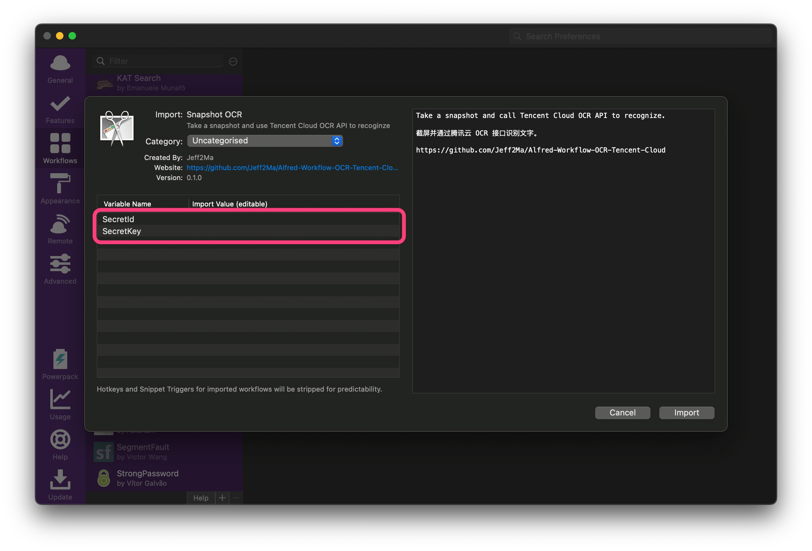
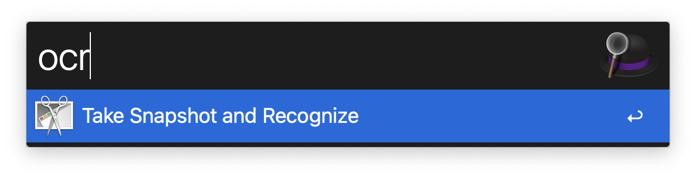

# Alfred-Workflow-OCR-Tencent-Cloud

Take a snapshot and use Tencent Cloud OCR API to recoginze.

截屏并通过腾讯云 OCR 接口识别文字的 Alfred Workflow。

## 使用方式

[下载本 Workflow ](https://github.com/Jeff2Ma/Alfred-Workflow-OCR-Tencent-Cloud/releases/)并安装。

需要从[腾讯云管理后台](https://console.cloud.tencent.com/cam/capi)获取`SecretId`、`SecretKey` 并填入如下的地方。

后续通过 `ocr` 关键词触发截屏并通过腾讯云 OCR 接口识别。成功识别后自动复制到系统剪切板并消息通知。

